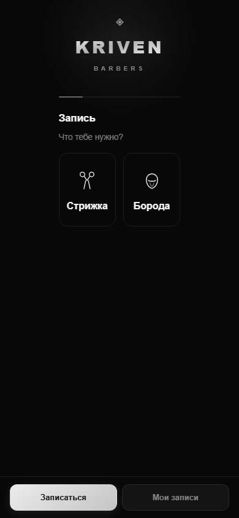
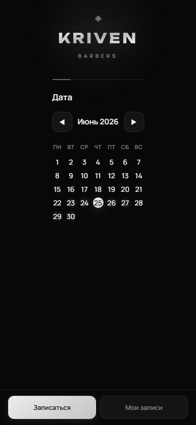
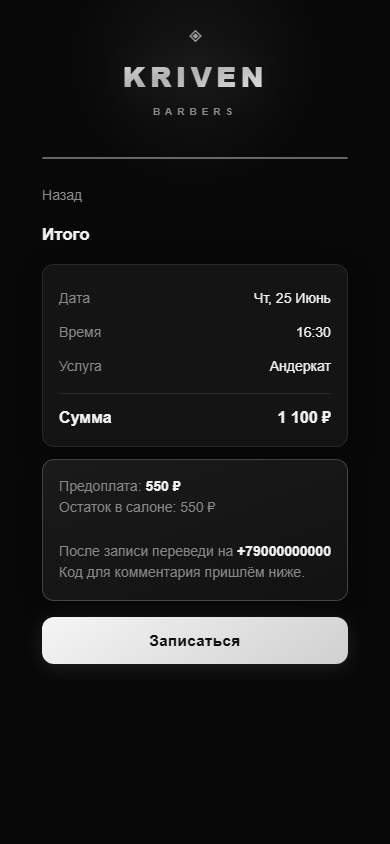
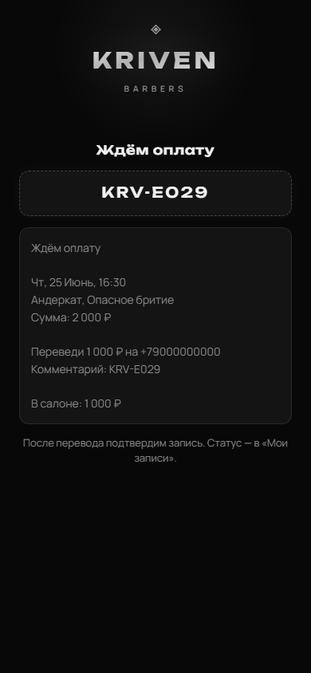
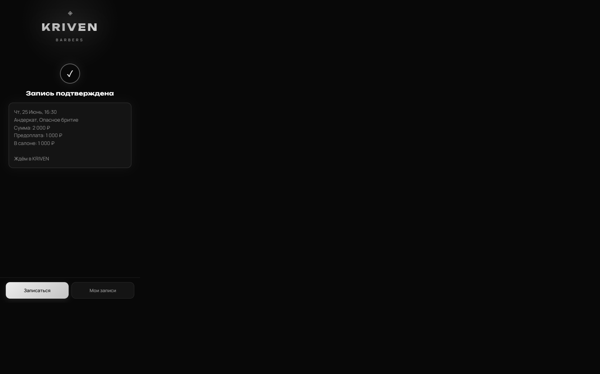
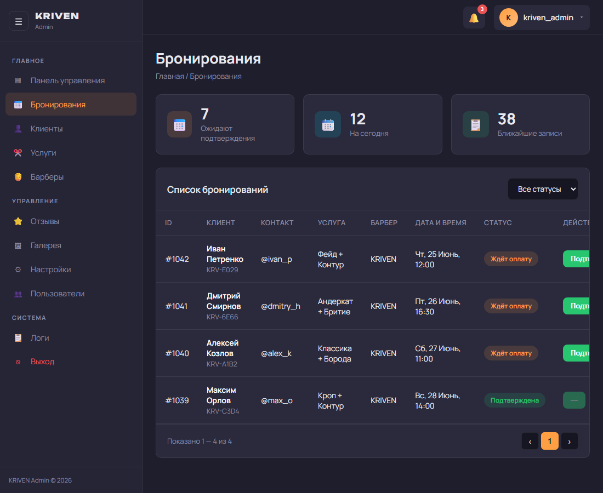
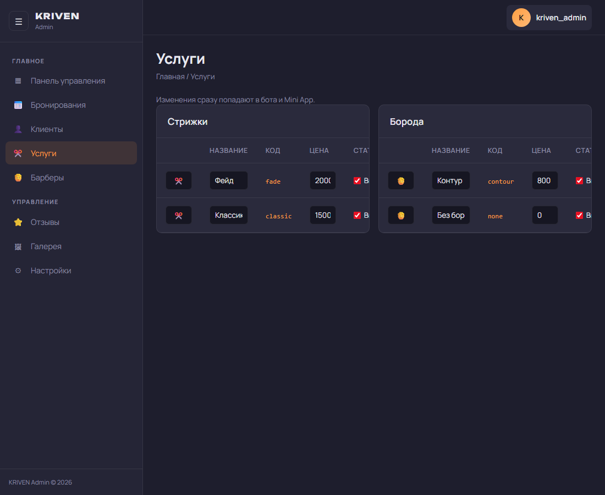

# KRIVEN BARBERS — запись в барбершоп через Telegram

Онлайн-запись прямо в Telegram: без звонков, без установки приложений, без долгой переписки.  
Клиент выбирает услугу, дату и время — видит цену и записывается за пару минут.

**Попробовать:** https://t.me/kriventestbot

---

## Для клиентов

Запись открывается как **Mini App** — обычное приложение внутри Telegram.

- Выбор **стрижки или бороды**
- Календарь со свободными датами и временем
- Прайс сразу на экране — без сюрпризов
- Предоплата по СБП с понятным кодом
- Вкладка **«Мои записи»** — статус и отмена
- Напоминание накануне визита

Ничего скачивать не нужно — только Telegram.

---

## Для владельца салона

Бот берёт рутину на себя:

- Заявки приходят в Telegram — не теряются в личке
- Предоплата с кодом `KRV-XXXX` — проще сверить перевод в банке
- Подтверждение одной кнопкой — клиент видит статус сразу
- **Админ-панель** в браузере: записи, клиенты, смена цен и настроек
- Напоминания клиентам — меньше неявок

Владелец меняет услуги, цены и часы работы сам — без программиста.

---

## Как это выглядит

### Запись клиента

| Выбор услуги | Календарь | Итого |
|:---:|:---:|:---:|
|  |  |  |

| Ожидание оплаты | Запись подтверждена |
|:---:|:---:|
|  |  |

### Панель владельца

| Записи | Услуги и цены |
|:---:|:---:|
|  |  |

---

## О проекте

Это **портфолио-проект** — пример того, как может работать запись для барбершопа или салона в Telegram.

Тёмный минималистичный дизайн, быстрый сценарий записи, предоплата и админка — всё в одном решении.

**Автор:** [bonnement](https://t.me/kriventestbot) — разработка Telegram-ботов и Mini App под ключ.
